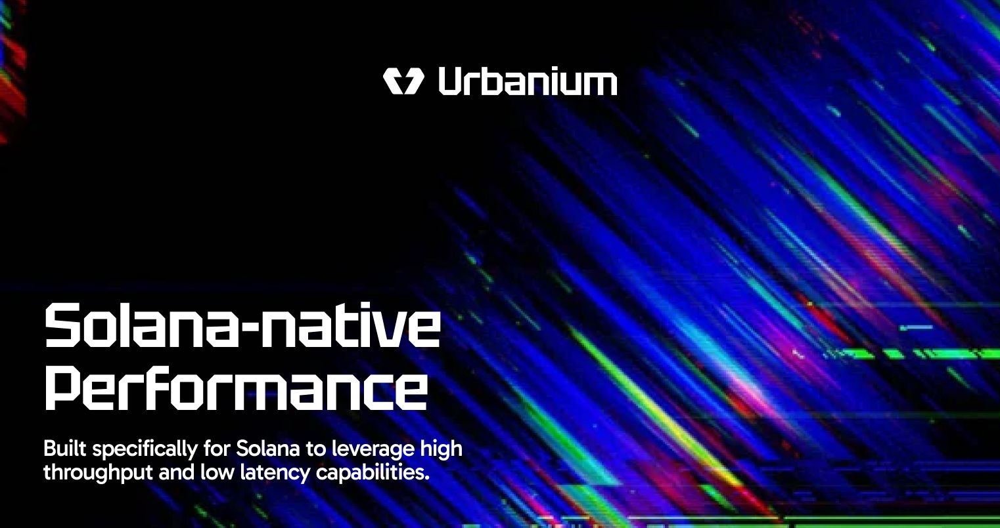

# Urbanium Protocol (Solana) — Technical Spec (Anchor Program + TypeScript SDK)

[](https://solana.com)
[](https://www.anchor-lang.com)
[](https://www.typescriptlang.org)
[](./LICENSE)


## Scope and Guarantees

Urbanium is a Solana-native vault protocol with the following invariants:

- **Single-asset vaults**: one vault is defined per SPL mint.
- **Non-custodial by construction**: no admin custody; there is no privileged “superuser” authority key.
- **All authority is deterministic PDAs**: token account owners are PDAs and can only sign via program-derived seeds.
- **Oracle-validated pricing only** for routing decisions (freshness + confidence + owner checks).

Program id (this repo’s configured deployment target):

- `7XzKxpTmsiTevyC9KYaFZbpGp9NnJ2VwK6ie7RdKZXBW`

Operational note: Rust/Anchor compilation requires local tooling (`rustup/cargo`, Solana CLI, Anchor CLI).

## Repository Structure

```
.
├── programs/urbanium/          # Anchor program (Rust)
├── sdk/urbanium-sdk/          # npm-publishable TypeScript SDK
├── idl/urbanium.json          # Optional JSON IDL artifact
├── docs/
│   ├── whitepaper.md
│   ├── architecture.md
│   ├── threat-model.md
│   ├── audit-checklist.md
│   └── investor-appendix.md
├── tests/                     # TS tests (localnet/dev workflows)
├── Anchor.toml
└── README.md
```

## Protocol Model

### State Objects

Urbanium uses exactly two program-owned accounts:

- `Vault`: global configuration and accounting for a single SPL mint.
- `UserPosition`: per-(vault, user) share ledger.

Total assets for share pricing are defined as the sum of balances in *vault-controlled SPL token accounts*:

- `vault_token_account`
- `yield_token_account_a`
- `yield_token_account_b`

No external accounts are included in accounting.

### PDA Model (Canonical, Non-Negotiable)

Seeds are fixed and MUST match exactly:

- `VAULT_SEED = "urbanium_vault"`
- `VAULT_AUTHORITY_SEED = "urbanium_vault_authority"`
- `USER_POSITION_SEED = "urbanium_user_position"`

Derivations (domain-separated):

- Vault PDA: `PDA([VAULT_SEED, mint])`
- Vault authority PDA: `PDA([VAULT_AUTHORITY_SEED, vault])`
- User position PDA: `PDA([USER_POSITION_SEED, vault, user])`

On-chain source of truth: [programs/urbanium/src/pda.rs](programs/urbanium/src/pda.rs)

SDK source of truth: [sdk/urbanium-sdk/src/pdas.ts](sdk/urbanium-sdk/src/pdas.ts)

## On-Chain Instruction Spec

Program: [programs/urbanium](programs/urbanium)

### `initialize_vault(args)`

Purpose:

- Creates the `Vault` PDA for `mint`.
- Derives a `vault_authority` PDA.
- Creates vault-owned ATAs for the vault mint (primary + two yield sub-accounts).
- Persists oracle configuration and routing threshold.

Oracle validation performed during initialization:

- `oracle_feed.owner == args.oracle_program` (owner check)
- price must be available and `publish_time` not older than `max_staleness_seconds`
- confidence bounded: $\text{conf\_bps} = \lfloor \text{conf} \cdot 10{,}000 / |\text{price}| \rfloor \le \text{max_confidence_bps}$
- `oracle_expo` pinned to current oracle exponent

Implementation: [programs/urbanium/src/instructions/initialize_vault.rs](programs/urbanium/src/instructions/initialize_vault.rs)

### `deposit(amount)`

Purpose:

- Transfers `amount` of vault mint from user ATA to `vault_token_account` using SPL Token `transfer_checked`.
- Mints shares into `UserPosition`.

Share math (checked, conservative rounding):

Let:

- $A$ = total assets (sum of vault-controlled token accounts)
- $S$ = total shares (`vault.total_shares`)
- $d$ = deposit amount

Then:

- If $S = 0$ or $A = 0$, shares minted = $d$
- Else shares minted = $\left\lfloor d \cdot S / A \right\rfloor$

Implementation: [programs/urbanium/src/instructions/deposit.rs](programs/urbanium/src/instructions/deposit.rs)

### `withdraw(shares)`

Purpose:

- Burns `shares` from `UserPosition`.
- Transfers underlying tokens from vault-controlled accounts to the user ATA.

Withdraw amount calculation:

- amount out = $\left\lfloor \text{shares} \cdot A / S \right\rfloor$

Deterministic liquidity sourcing order:

1) `vault_token_account`
2) `yield_token_account_a`
3) `yield_token_account_b`

Each transfer is SPL Token `transfer_checked` signed by the vault authority PDA.

Implementation: [programs/urbanium/src/instructions/withdraw.rs](programs/urbanium/src/instructions/withdraw.rs)

### `route_yield(amount)`

Purpose:

- Permissionless routing between vault-controlled token accounts.
- Moves `amount` from `vault_token_account` into exactly one of the two yield sub-accounts.

Routing decision:

- Reads oracle price with on-chain validation (owner + freshness + confidence).
- Enforces exponent pinned in `Vault`.
- Destination:
	- if `oracle_price.price >= vault.route_threshold_price` -> route to `yield_token_account_a`
	- else -> route to `yield_token_account_b`

Implementation: [programs/urbanium/src/instructions/route_yield.rs](programs/urbanium/src/instructions/route_yield.rs)

## Error Model

On-chain errors are explicit and stable for program clients.

- Program errors: [programs/urbanium/src/errors.rs](programs/urbanium/src/errors.rs)
- SDK error parsing: [sdk/urbanium-sdk/src/errors.ts](sdk/urbanium-sdk/src/errors.ts)

SDK behavior:

- If a transaction fails with a custom program error code, the SDK resolves `(code, name, msg)` against the canonical IDL and throws a structured error.

## SDK Installation

SDK package: [sdk/urbanium-sdk](sdk/urbanium-sdk)

```bash
npm i @urbanium/sdk
```

## Mainnet Usage Examples

### Deterministic PDA Derivation

```ts
import { PublicKey } from "@solana/web3.js";
import { deriveVaultPda, deriveVaultAuthorityPda } from "@urbanium/sdk";

const programId = new PublicKey("7XzKxpTmsiTevyC9KYaFZbpGp9NnJ2VwK6ie7RdKZXBW");
const mint = new PublicKey("So11111111111111111111111111111111111111112");

const [vault] = deriveVaultPda(programId, mint);
const [vaultAuthority] = deriveVaultAuthorityPda(programId, vault);
```

### Explicit Instruction Builders (IDL-Encoded)

```ts
import { PublicKey, SystemProgram } from "@solana/web3.js";
import { ASSOCIATED_TOKEN_PROGRAM_ID, TOKEN_PROGRAM_ID } from "@solana/spl-token";
import { buildInitializeVaultIx } from "@urbanium/sdk";

const ix = buildInitializeVaultIx(
	programId,
	{
		payer,
		mint,
		vault,
		vaultAuthority,
		vaultTokenAccount,
		yieldTokenAccountA,
		yieldTokenAccountB,
		oracleFeed,
		systemProgram: SystemProgram.programId,
		tokenProgram: TOKEN_PROGRAM_ID,
		associatedTokenProgram: ASSOCIATED_TOKEN_PROGRAM_ID,
	},
	{
		oracleProgram,
		oracleFeed,
		maxStalenessSeconds: 60n,
		maxConfidenceBps: 200,
		routeThresholdPrice: 0n,
	},
);
```

## SDK API Surface (What You Actually Call)

The SDK is intentionally explicit:

- PDA utilities: `deriveVaultPda`, `deriveVaultAuthorityPda`, `deriveUserPositionPda`
- Instruction builders: `buildInitializeVaultIx`, `buildDepositIx`, `buildWithdrawIx`, `buildRouteYieldIx`
- Account decoding: `decodeVault`, `decodeUserPosition`
- Oracle adapter (off-chain read helper): `readPythPrice`

All instruction data is encoded via `BorshInstructionCoder` against the canonical IDL, not hand-rolled layouts.

Source entrypoint: [sdk/urbanium-sdk/src/index.ts](sdk/urbanium-sdk/src/index.ts)

IDL source of truth used by coders and typings:

- [sdk/urbanium-sdk/src/urbaniumIdl.ts](sdk/urbanium-sdk/src/urbaniumIdl.ts)

## IDL / ABI Notes

- The SDK vendors a canonical Anchor 0.30+ compatible IDL as TypeScript (`urbaniumIdl`) to ensure stable typing and deterministic instruction encoding.
- The JSON IDL at [idl/urbanium.json](idl/urbanium.json) is an optional artifact location for external tooling. When local Solana/Anchor/Rust tooling is available, regenerate it via `anchor build` / `anchor idl` and sync as needed.

## Audit Checklist

See [docs/audit-checklist.md](docs/audit-checklist.md).

## Roadmap

- Add additional oracle adapters (while retaining owner/freshness/confidence enforcement).
- Add strategy adapters for external yield venues with allowlisted, deterministic CPI surfaces.
- Formal verification of share math invariants.

## License

MIT — see [LICENSE](LICENSE).
